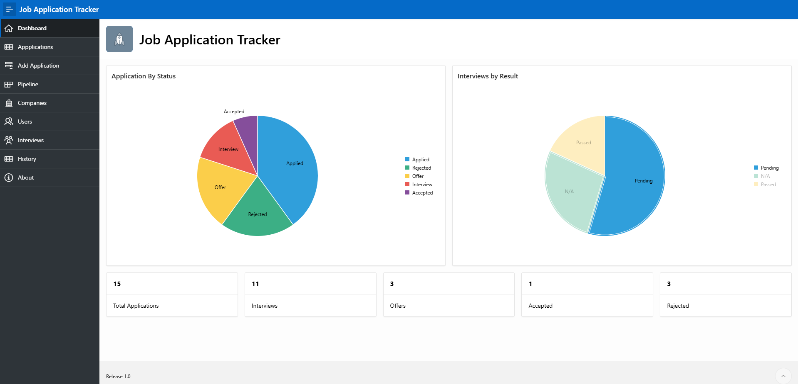
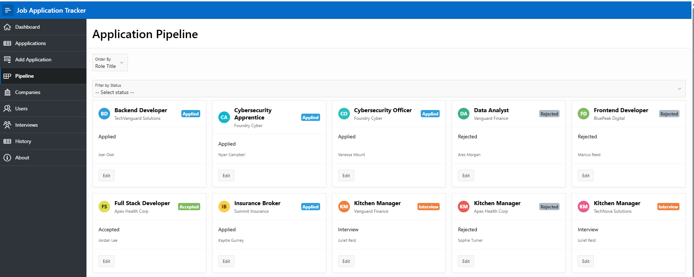
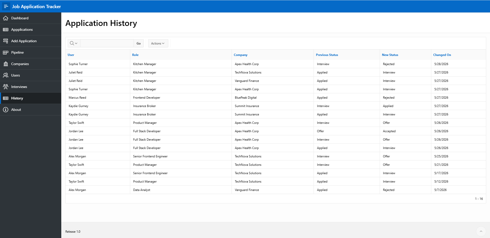
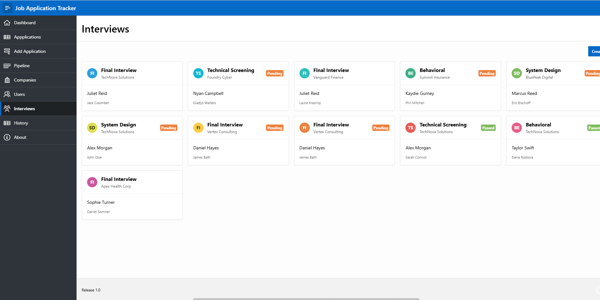
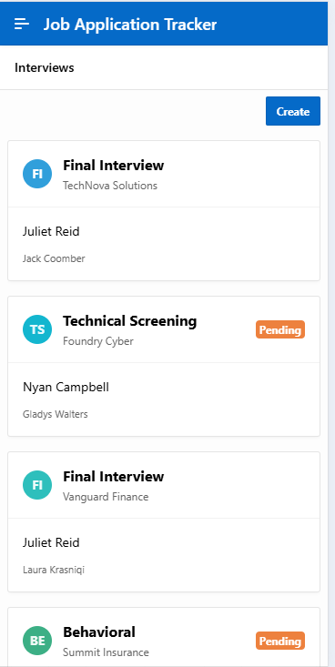

# Job Application Tracker

A full-stack job application management system built with Oracle APEX and PL/SQL that allows users to track job applications, manage interviews, monitor application stages, and maintain application history through an interactive workflow pipeline.

### Live Demo

Try the live application here:

https://gca2c3439af01cb-myappdb.adb.uk-london-1.oraclecloudapps.com/ords/r/myapp_ws/job-application-tracker/home

## Features

* Create and manage job applications
* Interactive application pipeline view
* Interview scheduling and tracking
* Automatic application history tracking
* Dynamic workflow-based redirects
* Interview stage and result tracking
* Interactive cards and reports
* Form validation using PL/SQL
* Trigger-based history logging
* Clean and responsive Oracle APEX UI

---

## Technologies Used

* Oracle APEX
* Oracle SQL
* PL/SQL
* Oracle Database
* Database Triggers
* PL/SQL Packages & Procedures
* Interactive Reports
* Cards Regions
* Form Processing (DML)

---

## Database Structure

### Main Tables

* `USERS`
* `COMPANIES`
* `JOB_APPLICATIONS`
* `INTERVIEWS`
* `APPLICATION_HISTORY`

### Relationships

* Users can have multiple job applications
* Companies can have multiple job applications
* Job applications can have multiple interviews
* Status changes are logged automatically in application history

---

## Key Functionality

### Job Application Workflow

1. Create a new job application
2. Application appears in the pipeline
3. Update application status
4. Selecting "Interview" redirects to interview creation
5. Interview details are stored and tracked
6. Status changes are automatically logged

---

## PL/SQL Features

### Package Functions

Custom validation logic including:

* Status validation
* Application ID validation
* Company validation
* Role title validation
* Date validation

### Database Trigger

A trigger automatically inserts records into `APPLICATION_HISTORY` whenever an application's status changes.

---

## Screenshots

### Dashboard

### Pipeline View

### Application History

### Interview Tracking

### Add Application Form

### Interview Tracking Smaller Screens

---

## Future Improvements

* User authentication and authorization
* Dashboard analytics
* Email reminders
* Calendar integration
* Advanced filtering and search
* Resume uploads
* Interview feedback system

---

## Getting Started

### Requirements

* Oracle APEX
* Oracle Database

### Setup

1. Import the exported Oracle APEX application
2. Run the database schema scripts
3. Insert sample data if required
4. Launch the application

---

## Author

Joel Osei

GitHub: https://github.com/Oseij96

Portfolio: https://joelosei.netlify.app/

---

## License

This project is for educational and portfolio purposes.