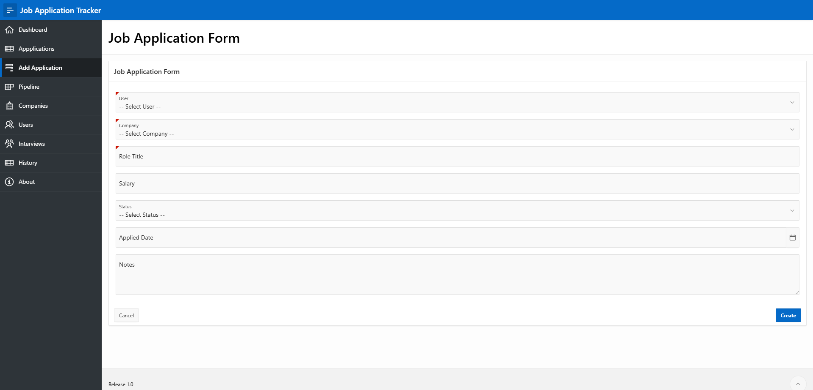

# Job Application Tracker

A job application management system built with Oracle APEX, Oracle SQL and PL/SQL. The application allows users to track job applications, manage interviews, monitor application stages and maintain a history of status changes.

### Live Demo

Try the live application here:

https://gca2c3439af01cb-myappdb.adb.uk-london-1.oraclecloudapps.com/ords/r/myapp_ws/job-application-tracker/home

## Features

* Create and manage job applications
* Interactive application pipeline view
* Interview scheduling and tracking
* Automatic application history tracking
* Dynamic workflow-based redirects
* Interview stage and result tracking
* Interactive cards and reports
* Form validation using PL/SQL
* Trigger-based history logging
* Responsive Oracle APEX UI

---

## Technologies Used

* Oracle APEX
* Oracle SQL
* PL/SQL
* Oracle Database
* Database Triggers
* PL/SQL Packages, Procedures and Functions
* Interactive Reports
* Cards Regions
* Form Processing (DML)

---

## Database Structure

### Main Tables

* `USERS`
* `COMPANIES`
* `JOB_APPLICATIONS`
* `INTERVIEWS`
* `APPLICATION_HISTORY`

### Relationships

* Users can have multiple job applications
* Companies can have multiple job applications
* Job applications can have multiple interviews
* Status changes are logged automatically in application history

---

## Key Functionality

### Job Application Workflow

1. Create a new job application
2. The application appears in the pipeline
3. Update the application status
4. Selecting "Interview" redirects to interview creation
5. Interview details are stored and tracked
6. Status changes are automatically logged in application history

---

## PL/SQL Features

### `JOB_APP_PKG`

The application uses a PL/SQL package to handle application logic and validation.

The package contains:

* Application status validation
* Application ID validation
* Company name validation
* Role title validation
* Date applied validation
* A procedure for validating and updating an application's status

### `TRG_APPLICATION_HISTORY`

A database trigger automatically inserts a record into `APPLICATION_HISTORY` whenever the status of a job application changes.

This separates the status update logic from the history logging: the package performs the validated update, while the trigger records the resulting status change.

---

## Project Structure

The repository includes:

* Database schema creation scripts
* PL/SQL package specification and body
* Application history trigger
* Sample data
* Oracle APEX application exports
* Application screenshots

The `export` directory contains:

* `f101.sql` — complete Oracle APEX application export
* `f101/` — split application export containing individual APEX components for source control

---

## Screenshots

### Dashboard

### Pipeline View

### Application History

### Interview Tracking

### Add Application Form

### Interview Tracking - Smaller Screens

---

## Future Improvements

* Role-based authorization
* Dashboard analytics
* Email reminders
* Calendar integration
* Advanced filtering and search
* Resume uploads
* Expanded interview feedback features

---

## Getting Started

### Requirements

* Oracle APEX
* Oracle Database

### Setup

1. Run the database schema creation script
2. Create the PL/SQL package and application history trigger
3. Insert the sample data if required
4. Import `export/f101.sql` into Oracle APEX
5. Run the application

The split export under `export/f101/` is also included for source control and component-level tracking.

---

## Author

Joel Osei

GitHub: https://github.com/Oseij96

Portfolio: https://joelosei.netlify.app/

---

## License

This project is for educational and portfolio purposes.
